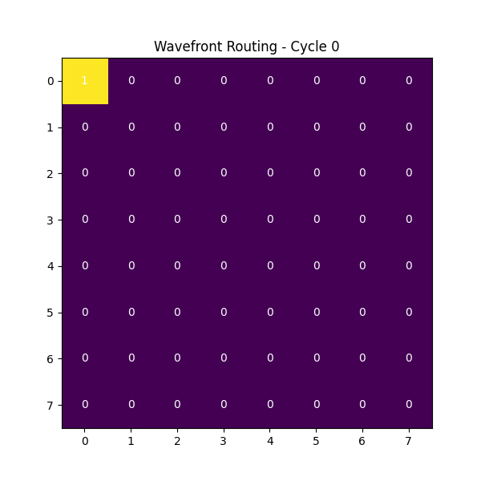
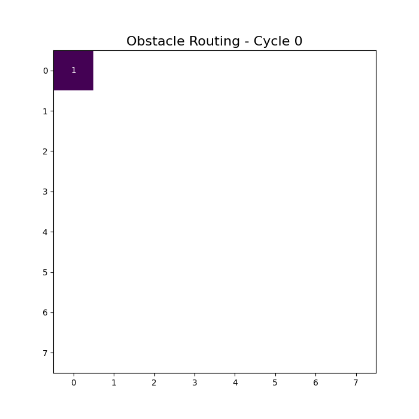
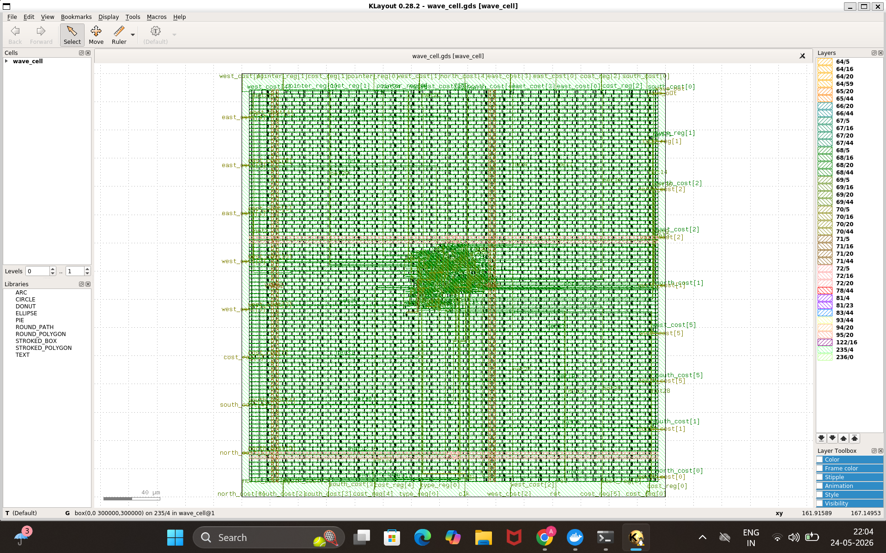
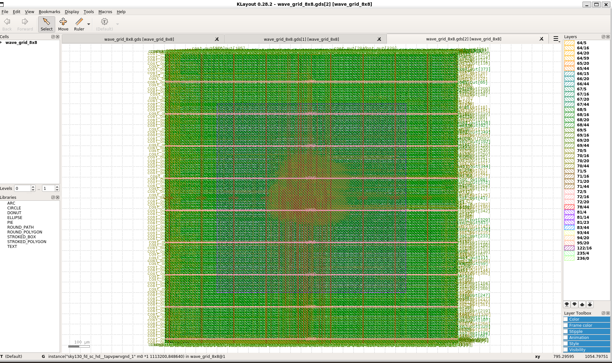

# Asynchronous Wave Propagation Router (v1.0)

A Hardware-Native Spatial Computing Accelerator Implementing Parallel Shortest-Path Routing via Non-von Neumann Wavefront Propagation on an 8x8 Tiled Array.

---

# Abstract

This work presents a hardware-native wavefront propagation accelerator implemented as a distributed spatial processing fabric composed of locally interconnected processing elements (`wave_cell`). Unlike conventional shortest-path algorithms executed sequentially on von Neumann architectures, the proposed system physicalizes routing directly into silicon using a synchronous nearest-neighbor propagation mesh.

Each processing element autonomously evaluates incoming directional cost signals, selects the minimum propagated path through local combinational reduction logic, updates an internal distance register, and stores a directional back-pointer for deterministic hardware backtracing. Global shortest-path solutions emerge naturally from synchronized local interactions without requiring centralized queues, routing tables, arbitration networks, or heuristic estimators.

The architecture supports:
- obstacle-aware routing
- distributed cost-field evolution
- programmable cost-depth scaling
- hardware directional breadcrumb tracking
- massively parallel spatial propagation

The system was implemented in synthesizable Verilog RTL, verified through cycle-accurate simulation using Icarus Verilog, and synthesized through the OpenLane ASIC flow targeting the SKY130 standard-cell process.

Unlike prior proprietary wavefront accelerators, this repository provides a fully open-source RTL-to-GDSII implementation including:
- RTL source code
- simulation infrastructure
- obstacle-routing demonstrations
- ASIC layout artifacts
- OpenLane integration scripts

This work demonstrates a Cellular Automata-inspired approach toward shortest-path computation, spatial graph traversal, and non-von Neumann routing fabrics implemented directly in digital silicon hardware.

---

# Keywords

- Wavefront Propagation
- Spatial Computing
- Cellular Automata
- Shortest Path Routing
- Non-von Neumann Computing
- Processing Element Arrays
- Hardware Pathfinding
- Parallel Routing
- Distributed Computing
- ASIC Design
- OpenLane
- SKY130
- Emergent Computation
- Hardware BFS
- Maze Routing
- Graph Acceleration
- Silicon Compute Fabrics
- Spatial Algorithms

---

# Related Work

Wavefront propagation for shortest-path routing has its theoretical foundation in the Lee algorithm (1961), a breadth-first search approach that expands a wavefront from a source node to find the shortest path in a grid. Traditional implementations execute this algorithm sequentially on von Neumann architectures, requiring centralized processing units to track queues, loop through nodes, and continuously fetch graph states from memory.

The closest prior work to our architecture is the *Time-Domain Wavefront Computing Accelerator* developed by the KAIST VLSI Lab, published in IEEE CICC 2021 and later extended in the *IEEE Journal of Solid-State Circuits* (2023). This 32×32 reconfigurable processing element (PE) array accelerator implements true time-domain wavefront propagation where signal delay itself represents spatial distance.

The KAIST chip, fabricated in 65-nm CMOS with a 1×1 mm² die area, achieves:
- 1.6 G edges/second search throughput
- 776 pJ per task energy efficiency
- rising-edge propagation-based shortest-path computation

Unlike heuristic algorithms such as A*, the KAIST accelerator performs shortest-path discovery through direct wave propagation without explicit distance estimation.

The architecture supports:
- shortest-path searching
- maze solving
- scientific wave simulations
- reconfigurable graph topologies

However, several key distinctions remain.

The KAIST implementation is proprietary:
- no RTL source code is publicly available
- no open ASIC flow exists
- no reproducible RTL-to-GDSII infrastructure is provided

Additionally, the KAIST design relies on analog tap-delay propagation for distance approximation and does not store explicit hardware directional back-pointers inside each processing element, requiring external post-processing to reconstruct final paths.

Cellular automata-based hardware accelerators for parallel maze routing have also demonstrated large speedups over sequential implementations using FPGA-based wave propagation systems. However, these designs typically:
- use fixed routing geometries
- lack programmable obstacle mapping
- omit directional backtrace metadata
- target FPGA-only implementations

Other parallelized pathfinding systems such as DuckPGQ (2024) focus primarily on GPU software acceleration rather than hardware-native spatial propagation fabrics.

Asynchronous Network-on-Chip (NoC) routers have explored mesh communication topologies with asynchronous handshaking and distributed packet transport. However, these systems optimize communication flow rather than shortest-path computation itself.

Similarly, FPGA wavefront accelerators for bioinformatics sequence alignment apply wave propagation principles to dynamic programming problems rather than spatial routing.

---

## Distinction From Prior Work

This work differs from prior architectures in several important ways:

1. **Open-Source RTL-to-GDSII Flow**  
   This repository provides a fully reproducible open-source ASIC implementation synthesized using OpenLane and SKY130, unlike prior proprietary wavefront accelerator chips.

2. **Digital Register-Based Distance Propagation**  
   The architecture uses explicit synchronous 6-bit cost registers rather than analog tap-delay approximations, enabling deterministic integer path costs.

3. **Hardware Directional Backtracking**  
   Each processing element stores a 2-bit directional breadcrumb pointer, enabling direct hardware-level shortest-path reconstruction.

4. **Obstacle-Aware Spatial Evolution**  
   The routing fabric supports hardwired obstacle barriers and localized rerouting behavior through distributed neighbor interactions.

5. **Cellular Automata-Inspired Distributed Computation**  
   Global shortest-path behavior emerges entirely from localized nearest-neighbor propagation without centralized route controllers or global routing tables.

6. **FPGA-Portable and MPW-Ready Architecture**  
   The design remains synthesizable using standard RTL flows and is directly portable to FPGA platforms and Efabless MPW shuttle infrastructure.

---

This architecture therefore represents a hardware-native, spatially distributed, and reproducible approach toward shortest-path acceleration and emergent routing computation in silicon.

---

# Obstacle-Free Wavefront Propagation

<p align="center">
  
</p>

<p align="center">
  Fig 1:- Emergent shortest-path wave expansion across a fully traversable 8×8 routing fabric.
</p>

---

# Obstacle-Aware Routing

<p align="center">
  
</p>

<p align="center">
  Fig 2:-Wavefront dynamically rerouting around hardwired obstacle barriers using purely local propagation rules.
</p>

---


# Single Processing Element (`wave_cell`)

<p align="center">
  
</p>

<p align="center">
  Fig 3:-Autonomous routing node implementing local cost evaluation, directional backtracking, and synchronous wave activation.
</p>

---

# 8×8 Spatial Routing Fabric (`wave_grid_8x8`)

<p align="center">
  
</p>

<p align="center">
  Fig 4:-Full tiled routing mesh synthesized into SKY130 standard-cell ASIC layout.
</p>

---

---

# Core Architecture Paradigm

Traditional pathfinding algorithms (such as Dijkstra or Breadth-First Search) execute sequentially inside von Neumann architectures. They depend heavily on centralized processing units tracking queues, looping through nodes, and continuously fetching graph states from memory.

This architecture instead physicalizes the pathfinding grid into a distributed processing element (PE) array. By mapping coordinates directly to spatial silicon logic blocks, shortest paths emerge naturally as an electronic wave expanding through the network.

The system operates across two discrete design layers:

1. `wave_cell.v` (Processing Element): An autonomous local tile that samples directional cost buses, executes asynchronous minimal-cost evaluations, and registers local route back-pointers.

2. `wave_grid_8x8.v` (Interconnect Fabric): A boundary-safe, 64-node spatial computing mesh that implements a static grid topology containing hardwired starting states, target nodes, and localized routing obstacles.

---

## Distributed Interconnect Fabric Topology

```text
       (0,0) Start             Boundary-Safe Interconnect Mesh
     ┌─────────────┐        ┌─────────────┐        ┌─────────────┐
     │  wave_cell  │◄──────►│  wave_cell  │◄──────►│  wave_cell  │
     │ [r=0, c=0]  │        │ [r=0, c=1]  │        │ [r=0, c=2]  │
     └──────┬──────┘        └──────┬──────┘        └──────┬──────┘
            ▲                      ▲                      ▲
            ▼                      ▼                      ▼
     ┌──────┴──────┐        ┌──────┴──────┐        ┌──────┴──────┐
     │  wave_cell  │◄──────►│  Obstacle   │◄──────►│  wave_cell  │
     │ [r=1, c=0]  │        │    WALL     │        │ [r=1, c=2]  │
     └─────────────┘        └─────────────┘        └─────────────┘
```

---

# Cellular Automata & Localized Emergent Computing

The architecture bypasses centralized coordination entirely. No single cell maintains a global perspective of the maze layout or the optimal trajectory. Instead, global shortest paths emerge organically from simple, localized boundary rules.

| Hardware State Attribute | Architectural Component Implementation |
|---|---|
| Wavefront Reception Status | 1-bit active registration flag (`wave_out`) |
| Localized Cost Accumulation | Parameterized cost-depth tracking register (`cost_reg`) |
| Directional Back-Pointer | 2-bit local routing breadcrumb vector (`pointer_reg`) |
| Spatial Interaction Mesh | Hardwired 4-directional neighborhood topology (North, South, East, West) |

---

# Core Cell Functional Mechanics

Every individual cell operates as an autonomous node executing a state evaluation loop based on its designated type register (`type_reg`).

---

## Node Type Classifications

### `FREE` (2'b00)

Unallocated space available for wave propagation.

Transitions from inactive to active upon receiving a valid cost signal from an adjacent neighbor.

---

### `WALL` (2'b01)

Structural routing obstacles.

These nodes suppress internal wave activation flags and force the wavefront to propagate around them.

---

### `START` (2'b10)

The initial source cell.

Hardwired to initialize immediately with an internal cost of `1`, functioning as the origin point of the routing wave.

---

### `TARGET` (2'b11)

The intended destination cell.

Acts as a normal routing element but designates the terminal boundary for external backtracking scripts.

---

# Parallel Minimal-Cost Selection Architecture

When a wave approaches an unactivated cell from multiple directions simultaneously, combinational selection logic identifies the shortest incoming pathway by determining the minimum cost value.

```text
    north_cost ────────┐
    south_cost ────────┼──► [ Combinational Minimum ] ──► min_neighbor_cost
    east_cost  ────────┼──► [  Selection Engine   ]
    west_cost  ────────┘                 │
                                         ▼
                                  best_direction
```

The cell executes an asynchronous, parallel reduction loop to isolate the lowest cost neighbor above zero:

```verilog
if (north_cost > 0 && north_cost <= min_neighbor_cost) begin
    min_neighbor_cost = north_cost;
    best_direction = DIR_NORTH;
end
```

Once identified, the cell locks its state on the next clock cycle, increments the localized distance value, and registers the source direction to preserve a deterministic path back to the origin.

---

## Cost Update Rule

```math
\text{cost\_reg} \Leftarrow \text{min\_neighbor\_cost} + 1
```

---

## Pointer Update Rule

```math
\text{pointer\_reg} \Leftarrow \text{best\_direction}
```

---

# Interconnect Signal and Bus Mapping

## `wave_cell` Processing Element Pinout

```text
                       ┌───────────────────────┐
        clk / rst ────►│                       │──────► wave_out
   [5:0] north_cost ──►│                       │
   [5:0] south_cost ──►│       wave_cell       │──────► [5:0] cost_reg
   [5:0] east_cost  ──►│   (Pixel Processor)   │
   [5:0] west_cost  ──►│                       │──────► [1:0] pointer_reg
   [1:0] type_reg  ───►│                       │
                       └───────────────────────┘
```

---

# Directional Pointer Bit-Mapping

The directional back-pointer matches the following 2-bit binary configurations:

- `2'b00` (`DIR_NORTH`) → shortest pathway approaches from the upper adjacent node
- `2'b01` (`DIR_SOUTH`) → shortest pathway approaches from the lower adjacent node
- `2'b10` (`DIR_EAST`) → shortest pathway approaches from the right adjacent node
- `2'b11` (`DIR_WEST`) → shortest pathway approaches from the left adjacent node

---

# Interconnect Mesh Architecture & Hardcoded Layout

The top-level `wave_grid_8x8.v` module instantiates 64 unique copies of the processing element using a Verilog `generate` loop block, flattening the structural interaction network into dense directional buses.

---

## Hardcoded Grid Geometry Configuration

The internal matrix establishes a fixed layout test case mapped onto raw grid coordinates:

- Source Node (`START`) → `(r == 0 && c == 0)` (Top-Left)
- Destination Node (`TARGET`) → `(r == 7 && c == 7)` (Bottom-Right)
- Obstacle Wall Structure → `r == 3` across columns `c == 1` through `c == 6`

This creates a solid horizontal barrier in the center of the grid, forcing the wavefront to split and round the edges.

---

# Boundary Condition Isolation

To prevent edge cells from reading invalid floating data, the array structure dynamically isolates perimeter nodes by grounding disconnected inputs.

```verilog
.north_cost((r == 0) ? 6'b0 :
            cost_bus[idx_n*COST_WIDTH +: COST_WIDTH]),
```

---

# Hardware Replication & Simulation Protocol

Run this execution workflow inside your Linux terminal environment to compile the simulation and verify the spatial propagation wavefront using Icarus Verilog.

---

## Project Structure

```text
openlane/designs/wave_router/
├── src/
│   ├── wave_cell.v
│   └── wave_grid_8x8.v
└── tb/
    └── tb_wave_router.v
```

---

# Part 1: Project Subdirectory Setup

```bash
# Enter Windows Subsystem for Linux
wsl

# Initialize design source subdirectories
cd ~/OpenLane/designs

mkdir -p wave_router/src

cd wave_router/src
```

---

# Part 2: Building the Processing Node Elements

```bash
nano wave_cell.v
```

Paste the complete `wave_cell` Verilog source code into the editor.

Save:
```text
CTRL + O
```

Exit:
```text
CTRL + X
```

---

# Part 3: Assembling the Routing Interconnect Fabric

```bash
nano wave_grid_8x8.v
```

Paste the complete `wave_grid_8x8` fabric source code into the editor.

Save and exit.

---

# Part 4: Compilation and Verification Execution

```bash
# Compile structural Verilog layers via Icarus Verilog

iverilog -o sim_wave_router \
wave_cell.v \
wave_grid_8x8.v \
../tb/tb_wave_router.v

# Execute compiled structural simulation

vvp sim_wave_router
```

---

# Future Implementations

- Dynamic SPI runtime grid-type configuration registers
- High-dimensional 3D mesh fabric extensions
- Variable-cost routing weights for variable terrain mapping
- Dynamic backtracking state-machines implemented directly in silicon hardware
- Massively scaled 64×64 processing element evaluation arrays

---

# Author

**Abhinav Basu**
