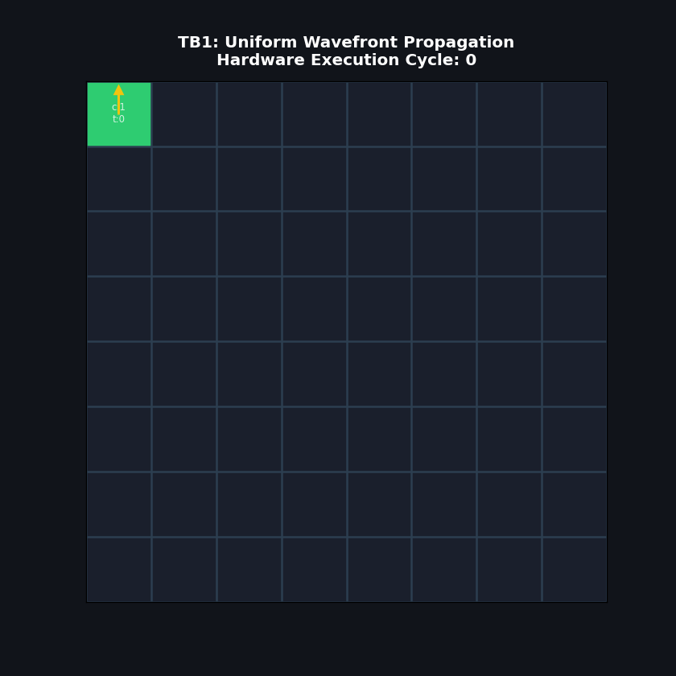
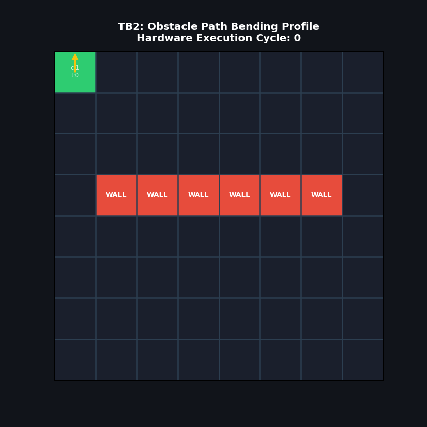
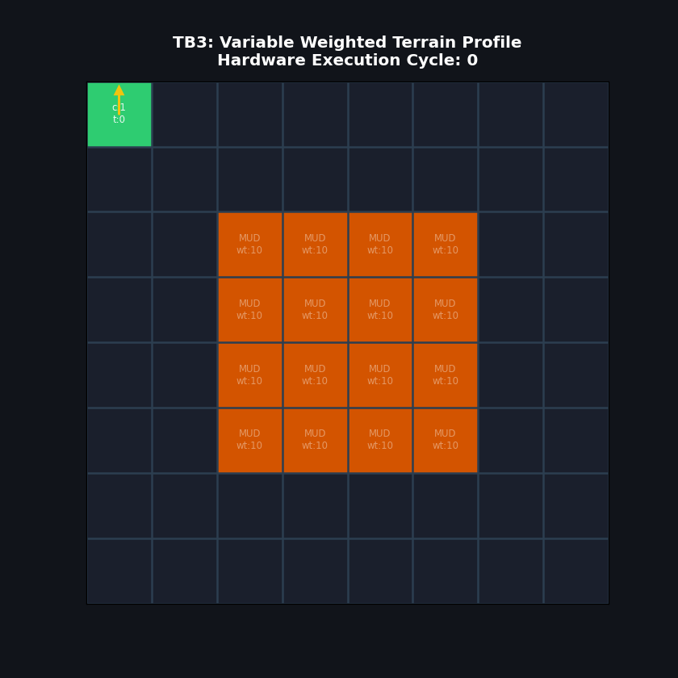
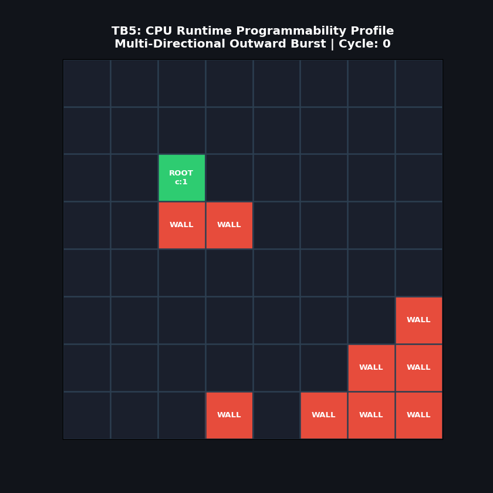

# Wavefront Routing Fabric v2

A Runtime-Programmable Spatial Routing Accelerator implementing distributed wavefront path planning, terrain-aware cost propagation, arrival-time encoding, and hardware backtrace generation on an 8×8 processing-element mesh.

---

## Overview

Traditional pathfinding algorithms such as Breadth-First Search (BFS), Dijkstra, and A* execute sequentially on von Neumann processors. They repeatedly fetch graph state from memory, evaluate neighboring nodes, and update centralized data structures.

This project explores an alternative hardware-native paradigm.

Instead of executing a pathfinding algorithm on a processor, the graph itself is physically instantiated as a spatial array of interacting processing elements (PEs). Path discovery emerges through local wave propagation, allowing all nodes to evaluate simultaneously.

The resulting architecture behaves as a programmable routing accelerator where shortest paths emerge directly from distributed hardware dynamics.

---

# Verification Demonstrations

## TB1 — Uniform Propagation

<p align="center">
  
</p>

<p align="center">
  Fig 1:- Uniform-cost wavefront expansion across the complete 8×8 mesh.
</p>

---

## TB2 — Obstacle-Aware Routing

<p align="center">
  
</p>

<p align="center">
  Fig 2:- Dynamic obstacle avoidance through purely local propagation rules.
</p>

---

## TB3 — Weighted Terrain Routing

<p align="center">
  
</p>

<p align="center">
  Fig 3:- High-cost terrain regions distort accumulated path cost while preserving arrival-time ordering.
</p>

---

## TB5 — Runtime Map Reconfiguration

<p align="center">
  
</p>

<p align="center">
  Fig 4:- Runtime relocation of START, TARGET, and obstacle nodes through the configuration interface.
</p>

---

# Architectural Evolution

| Capability | Router v1 | Router v2 |
|------------|-----------|-----------|
| Static Routing | ✓ | ✓ |
| Runtime Configuration | ✗ | ✓ |
| Obstacle Programming | Hardcoded | Runtime |
| Terrain Costs | ✗ | ✓ |
| Arrival Timestamps | ✗ | ✓ |
| Launch/Done Handshake | ✗ | ✓ |
| Cost Field Readback | ✓ | ✓ |
| Pointer Field Readback | ✓ | ✓ |
| Timestamp Field Readback | ✗ | ✓ |

---

# Core Architectural Idea

Every processing element represents a single grid coordinate.

Each node interacts only with its four immediate neighbors:

```text
North
  ↑
West ← Cell → East
  ↓
South
```

No node possesses a global view of the environment.

Global shortest paths emerge from purely local interactions.

---

# Processing Element Architecture

<p align="center">
  
</p>

<p align="center">
  Fig 5:- Wavefront processing element with terrain weighting and timestamp capture.
</p>

Each processing element maintains the following local state:

```text
wave_out         1 bit
cost_reg         6 bits
pointer_reg      2 bits
timestamp_reg    8 bits
terrain_weight   4 bits
```

---

# 8×8 Routing Fabric

<p align="center">
  
</p>

<p align="center">
  Fig 6:- Runtime-programmable spatial routing mesh.
</p>

The top-level fabric contains:

```text
64 Processing Elements
4-Way Neighbor Connectivity
Runtime Configuration Plane
Global Timestamp Counter
Launch/Done Interface
Multi-Bus Readback Network
```

---

# Runtime Configuration Interface

Unlike the original implementation, routing maps are no longer hardcoded into RTL.

A host processor dynamically programs:

```text
FREE cells
WALL cells
START nodes
TARGET nodes
Terrain weights
```

through the configuration interface.

## Configuration Signals

```verilog
cfg_write_en
cfg_type_data
cfg_weight_data
```

---

# Launch / Done Handshake

The accelerator behaves like a standalone hardware engine.

```text
CPU
 ↓
Program Grid
 ↓
Program Terrain
 ↓
Assert Launch
 ↓
Wavefront Execution
 ↓
Target Reached
 ↓
Done Signal
 ↓
Read Results
```

---

# Arrival-Time Encoding

A major addition in Router v2 is distributed timestamp capture.

Each processing element records the first cycle at which the routing wave reaches the cell.

```verilog
timestamp_reg <= global_time;
```

The timestamp is captured only once.

Subsequent arrivals are ignored.

---

## Timestamp Field

Represents:

```text
When was this cell reached?
```

Example:

```text
0 1 2 3
1 2 3 4
2 3 4 5
3 4 5 6
```

---

# Terrain-Aware Cost Propagation

Each cell possesses an independent terrain weight.

Examples:

```text
Road     = 1
Grass    = 3
Sand     = 5
Swamp    = 10
```

Cost accumulation follows:

```text
cost =
minimum_neighbor_cost
+
terrain_weight
```

---

## Cost Update Rule

```math
Cost_{cell}
=
\min(NeighborCosts)
+
TerrainWeight
```

---

# Cost vs Timestamp

One of the most interesting observations from the verification suite is that arrival time and path cost become different information fields once terrain weighting is introduced.

## Timestamp Field

Measures:

```text
Propagation order
```

## Cost Field

Measures:

```text
Traversal expense
```

Weighted terrain decouples these quantities.

---

# Hardware Backtrace Generation

Each cell stores a directional breadcrumb:

```text
00 = North
01 = South
10 = East
11 = West
```

This allows a host processor to reconstruct the discovered route by tracing pointers backward from the destination node.

---

# Accelerator Readback Buses

The fabric exposes complete state snapshots.

```verilog
wave_out_bus
cost_out_bus
pointer_out_bus
timestamp_out_bus
```

These buses provide visibility into the entire computational state of the accelerator.

---

# Verification Summary

| Testbench | Purpose | Status |
|------------|----------|---------|
| TB1 | Uniform Propagation | PASS |
| TB2 | Obstacle Routing | PASS |
| TB3 | Weighted Terrain | PASS |
| TB4 | Timestamp Stability | PASS |
| TB5 | Runtime Reconfiguration | PASS |

---

# Repository Structure

```text
wavefront-routing-fabric/

├── src/
│   ├── wave_cell_v2.v
│   ├── wave_grid_8x8_v2.v
│   └── tb_wave_grid_v2.v
│
├── docs/
│   ├── wave_cell_v2.png
│   ├── wave_grid_v2.png
│   └── architecture_overview.png
│
├── gifs/
│   ├── TB1_uniform_propagation.gif
│   ├── TB2_obstacle_bending.gif
│   ├── TB3_weighted_terrain.gif
│   └── TB5_runtime_remapping.gif
│
└── README.md
```

---

# Future Directions

- 16×16 and 32×32 mesh scaling
- Hardware path extraction engines
- DMA-based host interface
- Adaptive terrain learning
- Timestamp-driven routing heuristics
- FPGA implementation
- OpenLane / SKY130 ASIC synthesis
- Comparison with neuromorphic timestamp-routing architectures

---

# License

MIT License

---

# Author

**Abhinav Basu**
